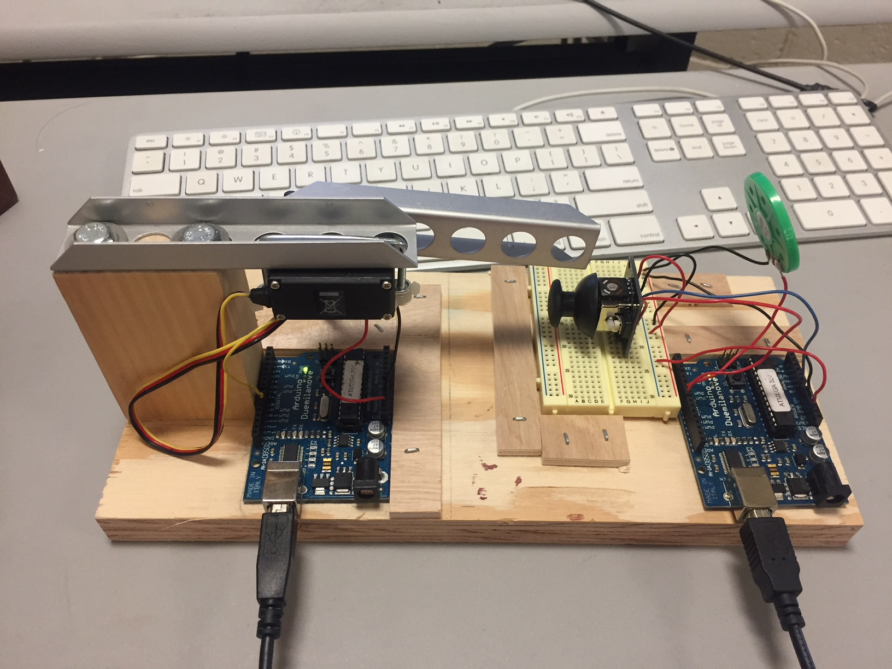
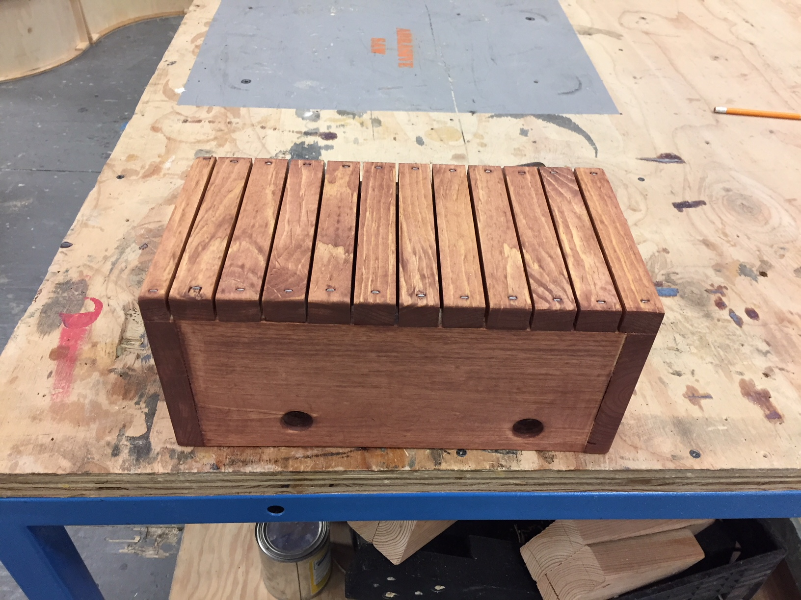
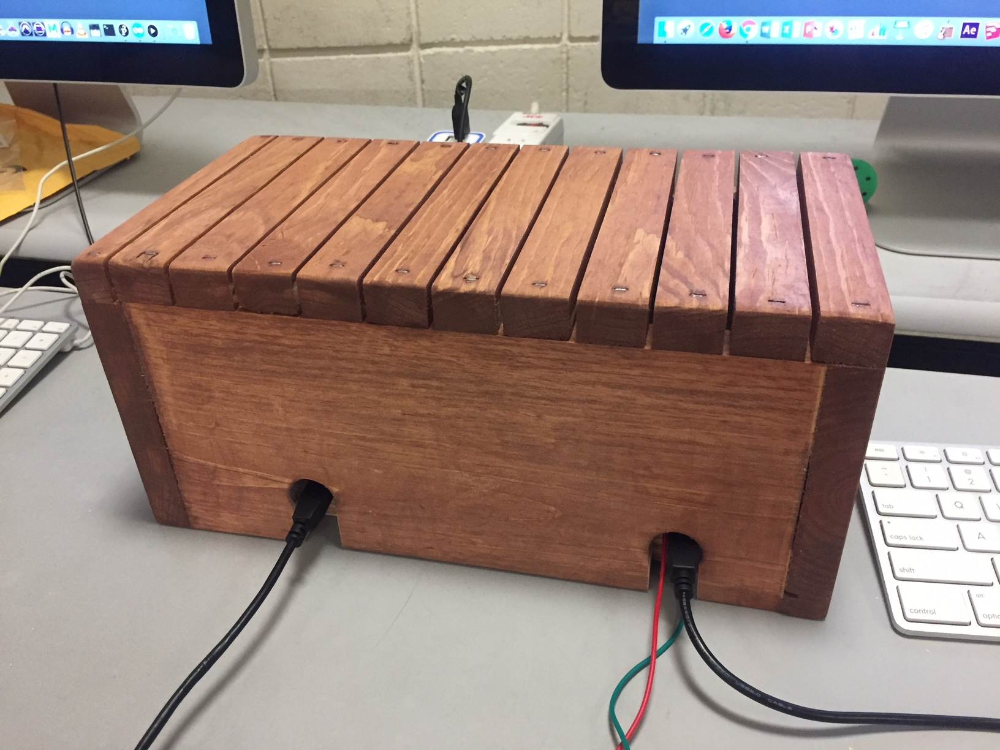

Final Project Description.
Morse Code Translator Robot.

   For my final project I picked to make a robot arm that whould take a keyboard input from 
Arduino Serial Monitor, and translate it into a morse code. Originally, I planed for a robot arm
just to knock the code on the table surface, but later I decided to add some kind of button that 
the arm can press and the beeping sound would come out from a speaker; this way the code would be
more recognizable.

   The main challenge for me was to find a way for the arm to react on the keyboard input in a certain
way. It took all of the 1st week of work on the project. First, I tried to change the Pong Ball processing 
sketch and make a ball react on keyboard input. But that didn't bring me anywhere because the ball kept moving 
not the way I needed it to. I then did a research online where I found different approaches to the problem. I 
tried to apply it to my project to both arduino and processing sketches, but nothing worked again. 

   On the 2d week of the project I asked for help in class, and the decision was not to use Processing at all,
but simply write a code in Arduino, that would take a string input, and, using the "if" statement, analyze each 
character in the string and react on it in a certain way according to the rules and alphabet of the morse code.
Here is that part of the code that helped me to analyze the string input.
    
    String str = Serial.readStringUntil('\n');
    Serial.println(str);
    for (int i = 0; i < str.length(); i++) {
      char myChar = str.charAt(i);
      
      if (myChar == 'a'|| myChar == 'A') {
        makeDot();
        makeDash();
      }
      ...
     }
     
   After that the work went quickly. I just had to assign to each character a certain movements of the arm to do 
with the correct timing of delays: one time unit for the dot, three time units for the dash and pause between 
characters, and seven time units for the space between words.

   The next challange for me was to find a button that the flimsy robot arm would be able to press without breaking
off. This is where I decided to use joystick, because it moves out of its' home position very easily. Turned out that 
I had to use a second arduino in order to connect a joystick and speaker to it. So in the second code, when the joystick 
is moved out of its' home position - the speaker is making the beeping sound.

   There is more description added to the code itself.

   All I had left to do in the 3d week of work is to make a box and some kind of stop blocks to hold the parts of my
project on the right spot. It took me 1.5 hours to make those, and 30 more minutes for cutting holes for wires, sanding 
and applying wood stain. On the last day I realized that It will be better to make slots for wires rather than holes, 
so I can put the box on and off without disconnecting the wires.

So here is 2 videos of my project, and some pictures:

Morse Code Translator Robot:

https://www.youtube.com/watch?v=3cd-Etb6bRo&feature=youtu.be

With the box on:

https://www.youtube.com/watch?v=w97OT5pSM00&feature=youtu.be

Stop blocks

The box was made out of scrap (pine) I found in our shop

 
Stained box

Final product

